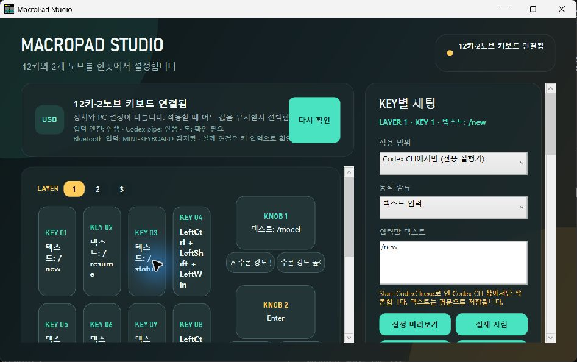

# MacroPad Studio

Windows에서 지원되는 12키·2노브 매크로패드의 세 레이어와 LED를 설정하고,
선택적으로 Codex CLI 상태를 키 LED로 표시하는 오픈 소스 도구입니다.



## 지원 범위

- 제품: [AliExpress 판매 페이지의 12키·2노브 모델](https://www.aliexpress.com/item/1005006437127027.html)
- 운영체제: Windows 10/11 x64
- 설정 연결: USB
- 일반 키 입력: USB 또는 Bluetooth
- 확인된 HID 조건: VID `514C`, PID `8850`, 인터페이스 `0`, Usage Page `FF00`, 25슬롯·3레이어 구조

같은 VID/PID라도 보고서 구조가 다르면 지원하지 않습니다. 일치 후보가 두 대 이상 연결되면
잘못된 장치를 고르지 않도록 중단하므로 설정할 제품 한 대만 USB로 연결하세요.

## 사용하기

1. GitHub Releases에서 `MacroPadStudio-v1.0.0-beta.1-win-x64.zip`을 받습니다.
2. 원하는 폴더에 압축을 풉니다.
3. `CodexKeyboardStudio.exe`를 실행합니다. 이 파일명은 첫 베타의 내부 호환 이름이며 화면에는 MacroPad Studio로 표시됩니다.
4. 레이어와 키·노브 동작을 편집한 뒤 `변경 내용 적용`을 누릅니다.

적용 직전에 현재 레이어 25슬롯과 LED 상태가
`%LocalAppData%\CodexKeyboardStudio\backups\latest.json`에 저장됩니다. 문제가 생기면 앱의
`최근 백업으로 복원`을 사용하세요. 백업 체크섬이나 장치 구조가 다르면 복원 쓰기는 시작되지 않습니다.

키보드 연결 해제, PC 절전·종료 또는 USB 오류는 기록 도중에도 발생할 수 있습니다. 중요한 기존
설정은 제조사 프로그램에서도 별도로 기록해 두는 것을 권장합니다. 이 베타는 코드 서명되지 않아
Windows가 게시자 경고를 표시할 수 있습니다.

## Codex CLI 상태 연동

Codex 상태 연동은 선택 기능입니다. 앱의 `설치 / 복구`는 기존 사용자 훅을 보존하고 이 앱의 훅
7개만 직접 병합하므로 PowerShell 실행이나 실행 정책 변경이 필요 없습니다. 새 Codex CLI에서
`/hooks`를 열어 내용을 직접 검토하고 신뢰해야 동작합니다.
훅은 프롬프트나 도구 내용을 보내지 않고 이벤트 종류와 임의 세션 식별 정보만 현재 사용자용
로컬 named pipe에 전달합니다.

이 베타의 PowerShell 없는 훅 설치·복구는 자동 시험을 통과했지만, 이전 실행 정책 문제가 발생한
별도 Windows에서는 최종 빌드를 다시 검증하지 못했습니다. 설치 후 앱의 `7/7` 표시와 Codex CLI
`/hooks`를 확인하세요. 실패하더라도 키·노브·LED 설정 기능에는 영향을 주지 않습니다.

## 소스에서 빌드

필요 항목:

- Windows x64
- .NET 10 SDK
- Visual Studio 2022 Build Tools의 C++ x86/x64 도구
- 첫 빌드 시 공식 HIDAPI 릴리스를 내려받을 인터넷 연결

```powershell
powershell.exe -NoProfile -ExecutionPolicy Bypass -File .\scripts\build-v1-portable.ps1
powershell.exe -NoProfile -ExecutionPolicy Bypass -File .\scripts\test-v1-settings.ps1
powershell.exe -NoProfile -ExecutionPolicy Bypass -File .\scripts\test-v1-foundation.ps1
powershell.exe -NoProfile -ExecutionPolicy Bypass -File .\scripts\test-v1-runtime.ps1
powershell.exe -NoProfile -ExecutionPolicy Bypass -File .\scripts\check-readiness.ps1 -DevelopmentWorktree
```

빌드 스크립트는 공식 HIDAPI 0.15.0 Windows ZIP과 x86 DLL의 SHA-256을 모두 확인합니다.
자동 시험은 실제 하드웨어 변경을 차단합니다. `-ConfirmHardwareWrite`가 필요한 실물 쓰기 진단은
일반 사용자 공개본에서 제공하지 않습니다.

## 라이선스

MacroPad Studio 소스는 [MIT License](LICENSE)로 제공됩니다. 이는 사용·복사·수정·배포·상업적
이용을 폭넓게 허용하지만 저작권 및 허가 고지를 유지해야 하고, 보증이나 손해배상 책임을 제공하지
않는다는 뜻입니다. self-contained 패키지에 포함된 .NET·WPF·Windows SDK 구성요소와 HIDAPI에는
별도 조건과 고지가 적용됩니다. 배포물의 `DOTNET-*`, `WPF-*`, `WINDOWS-SDK-LICENSE.rtf` 및
[THIRD_PARTY_NOTICES.md](THIRD_PARTY_NOTICES.md)를 확인하세요.
