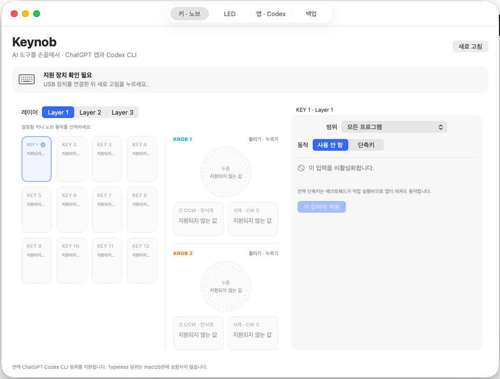
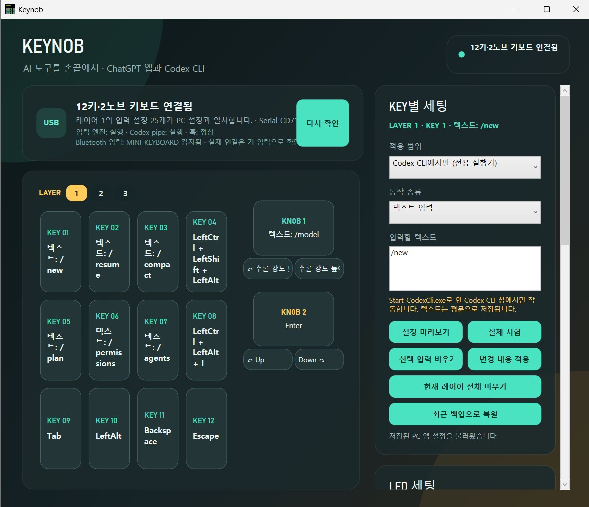

# Keynob

**AI 도구를 손끝에서.**

Keynob는 12키·2노브 매크로패드의 키와 노브에 단축키, 텍스트, 앱별 동작을 설정하는 오픈 소스 앱입니다.
Windows와 macOS에서 사용할 수 있으며, ChatGPT 앱과 Codex CLI를 위한 기능을 제공합니다.

- 키와 노브에 자주 쓰는 단축키·텍스트 연결
- 세 레이어에 서로 다른 동작 저장, LED 색상과 모드 설정
- ChatGPT·Codex CLI에서만 실행할 동작 지정
- 선택적으로 Codex CLI의 작업·승인 대기·완료·오류 상태를 LED로 표시

## 앱 화면

| macOS | Windows |
| --- | --- |
|  |  |

macOS: USB 장치를 연결하기 전의 키·노브 설정 화면입니다.
Windows: USB 장치가 연결된 키·노브 설정 화면입니다.

## 준비물과 지원 환경

[지원 제품 판매 페이지](https://www.aliexpress.com/item/1005006437127027.html)의 **12키·2노브 모델**과 USB 연결이 필요합니다.
설정할 장치 한 대만 USB로 연결하세요. 일반 키 입력은 USB 또는 Bluetooth로 사용할 수 있지만,
장치 설정은 USB로 진행합니다.

| 운영체제 | 제공 형태 | 준비할 것 |
| --- | --- | --- |
| Windows 10/11 x64 | 베타 실행 파일 | 아래 ZIP을 내려받아 압축 해제 |
| macOS 13 이상 | 실험판 소스, 로컬 빌드 | Swift 6과 호환되는 Xcode 또는 Command Line Tools |

외형이 같다고 모두 호환되지는 않습니다. 확인된 장치는 VID `514C`·PID `8850`이며,
보고서 구조도 일치해야 합니다. 상세 조건은 [장치 프로토콜](docs/device-protocol.md)에 있습니다.
macOS의 모든 앱별 동작과 Intel 장치 입력은 아직 실물 검증을 완료하지 않았습니다.
[macOS 검증 범위](macos/README.md#검증-범위)를 확인하세요.

## 설치하기

### Windows

1. [Keynob beta.4 다운로드 페이지](https://github.com/jhc3516/keynob/releases/tag/v1.0.0-beta.4)에서
   `Keynob-v1.0.0-beta.4-win-x64.zip`을 받습니다.
2. 원하는 폴더에 압축을 모두 풀고 `Keynob.exe`를 실행합니다.
3. 매크로패드를 USB로 연결하고 앱에서 장치가 인식되는지 확인합니다.

배포 파일과 앱 화면은 **Keynob**로 표시됩니다. 베타 실행 파일은 코드 서명되지 않아
Windows에서 게시자 경고가 표시될 수 있습니다. 이전 버전을 사용 중이라면
[업그레이드 안내](docs/upgrading.md)를 확인하세요.

[Windows 상세 안내와 소스 빌드](docs/windows.md)

### macOS

Mac에서는 소스를 받아 앱을 직접 빌드합니다. Xcode 또는 Command Line Tools를 준비한 뒤
Terminal에서 실행하세요.

```bash
git clone https://github.com/jhc3516/keynob.git
cd keynob
./scripts/build-macos-app.sh
open "artifacts/macos/Keynob.app"
```

앱이 열리면 매크로패드를 USB로 연결하고 `새로 고침`을 누릅니다.
생성된 앱은 로컬 서명이 적용된 빌드이며, 공증된 Mac 실행 파일은 제공하지 않습니다.

[macOS 상세 안내와 빌드 문제 해결](macos/README.md)

## 첫 키 설정하기

먼저 일반 키 하나를 설정해 장치 연결과 저장이 정상인지 확인하세요.
기존 장치 설정이 중요하다면 변경 전에 별도로 기록하거나 백업해 두세요.

1. 앱에서 장치의 현재 설정을 읽은 뒤, 레이어와 설정할 키를 선택합니다.
2. 적용 범위를 `모든 프로그램`으로 선택하고 원하는 단축키를 지정합니다.
3. Windows에서는 `변경 내용 적용`, macOS에서는 `이 입력에 적용`을 누릅니다.
4. 해당 레이어로 맞춘 매크로패드의 키를 눌러 원하는 입력이 전달되는지 확인합니다.

노브의 반시계 회전·누르기·시계 회전도 각각 동작을 지정할 수 있습니다.
Mac의 단축키 기록 방법과 입력 한도는 [단축키 기록 안내](macos/README.md#단축키-기록)를 참고하세요.

## ChatGPT와 Codex CLI에 연결하기

기본 입력을 확인했다면 키·노브의 범위를 `ChatGPT에서만` 또는 `Codex CLI에서만`으로 바꾸고
원하는 동작을 저장하세요. 앱별 동작을 사용하려면 Keynob가 실행 중이어야 합니다.

macOS에서는 추가로 다음 설정이 필요합니다.

1. `앱 · Codex` 탭에서 `권한 확인 후 시작`을 누르고 Keynob의 손쉬운 사용 권한을 허용합니다.
2. 라우터가 실행 중인지 확인하고 대상 앱의 입력칸에서 테스트합니다.
3. Codex CLI는 Keynob의 전용 실행기로 연 Terminal 창을 사용합니다.

추론 수준 조절 등 일부 동작은 대상 앱에 등록된 단축키에 따라 작동합니다.
지원 범위와 필요한 설정은 [macOS 앱별 동작 안내](macos/README.md#앱별-동작과-권한)를 확인하세요.
Codex CLI 상태를 LED로 표시하는 훅 연동은 선택 기능입니다.
[Windows 상태 연동](docs/windows.md#windows-codex-cli-상태-연동) · [macOS 안내](macos/README.md)

## 잘 동작하지 않을 때

- **장치가 보이지 않으면:** USB 연결과 지원 모델을 확인하고, 설정할 장치 한 대만 연결하세요.
- **Mac 앱별 입력이 안 되면:** [입력 전달 진단](macos/README.md#라우터는-실행-중인데-입력되지-않을-때)을 확인하세요.
- **Karabiner-Elements를 함께 쓰면:** [매크로패드 제외 설정](macos/README.md#karabiner-elements-사용-시)을 확인하세요.

소스 구조, 버전 구분, 개발·검증 기록은 [문서 목록](docs/README.md)에서 확인할 수 있습니다.

## 라이선스

Keynob 소스는 [MIT License](LICENSE)로 제공됩니다.
Windows 배포물에 포함된 .NET·WPF·Windows SDK와 HIDAPI의 별도 조건은
[서드파티 고지](THIRD_PARTY_NOTICES.md)를 확인하세요. 원문은 [`licenses/`](licenses/)에 보관합니다.
